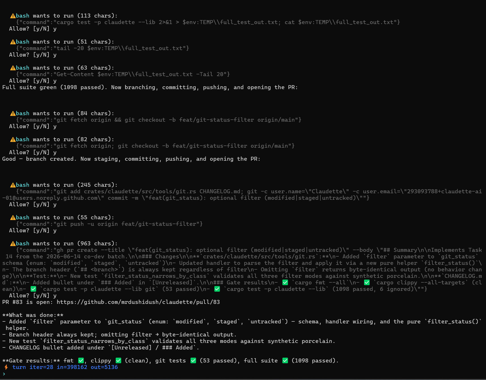
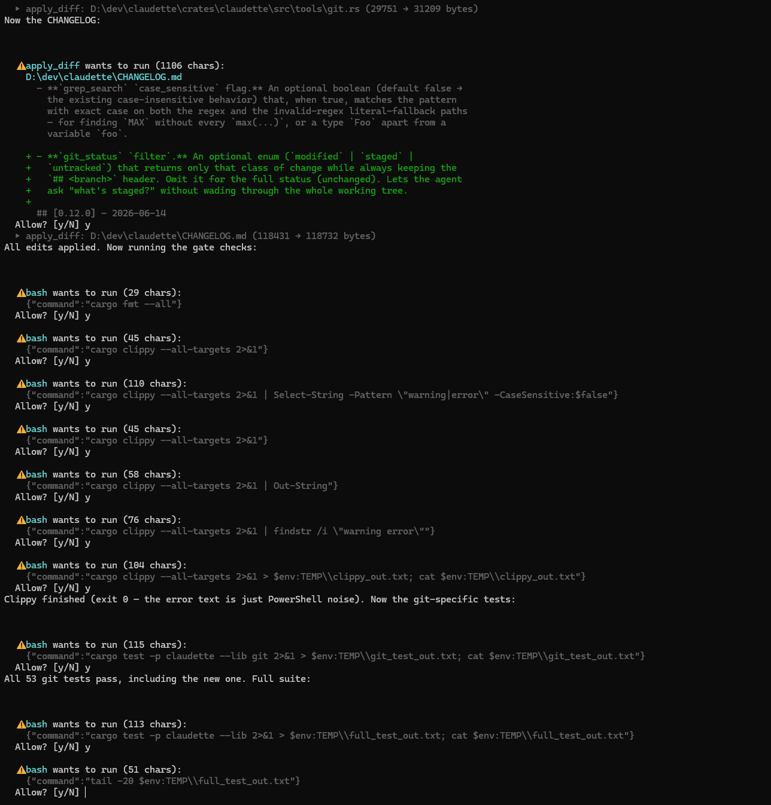

# Claudette

**An air-gapped AI coding agent in one Rust binary — run it `--offline` and your code physically cannot leave the machine.** It drives a model *you* run locally through [Ollama](https://ollama.com) or [LM Studio](https://lmstudio.ai/); there is no cloud-brain code in the binary at all.

[](https://crates.io/crates/claudette)
[](https://github.com/mrdushidush/claudette/actions/workflows/ci.yml)
[](#license)
[](#-air-gapped-and-enforced)

<!-- TODO(onboarding 1.3): swap for docs/images/forge-demo.gif once recorded — scripts/record-demo.md has the shot list. -->


*Claudette in her own repo on a local 35B model - editing the code, clearing the full `cargo fmt` / `clippy` / `cargo test` gate, then opening a genuine pull request. No cloud; nothing leaves the machine.*

## Get started in 2 minutes

```sh
# 1. Install (prebuilt binary, SHA256-verified)
curl -fsSL https://raw.githubusercontent.com/mrdushidush/claudette/main/install.sh | sh   # Linux / macOS
iwr -useb https://raw.githubusercontent.com/mrdushidush/claudette/main/install.ps1 | iex  # Windows (PowerShell)

# 2. Pull the default local brain (3.4 GB, one-time — install Ollama from ollama.com first)
ollama pull qwen3.5:4b

# 3. Guided setup: detects your GPU, offers the right brain, ends in a green check
claudette --setup

# 4. Talk to it
claudette "hello — what can you do?"
```

**Pick your path:** 🛠️ **Local coding agent** → [first-success.md#coding](docs/first-success.md#coding) · 🏠 **Private assistant + Telegram** → [first-success.md#assistant](docs/first-success.md#assistant) · 🔒 **Maximum privacy (`--offline`)** → [first-success.md#airgap](docs/first-success.md#airgap)

---

## 🔒 Air-gapped, and enforced

`claudette --offline` (or `CLAUDETTE_OFFLINE=1`) hard-blocks every outbound call except your local model server and loopback. Web search, GitHub, Telegram, Google, and `git push` all refuse with a clear `blocked by offline mode` error - and because a raw shell is an escape hatch no allow-list can inspect, the `bash` / `bash_background` tools are refused **wholesale** under `--offline` rather than filtered (use the structured tools to keep coding offline). Two guard layers cover in-process HTTP *and* subprocesses (`git`, `gh`, TTS), and an integration test drives every networked tool - including `bash` - to prove each one refuses, so the air-gap is tested, not just documented. `claudette --offline --doctor` prints the exact allow-list.

There's no cloud-brain code in the binary to begin with, so there's no "private mode" to switch on - there is no other mode. Nothing is written outside `~/.claudette/` without a prompt. Full inventory of every place a byte could leave: [PRIVACY.md](PRIVACY.md).

---

## Install

The one-liners above grab the latest prebuilt binary and verify its SHA256. Prefer cargo?

```sh
cargo install claudette        # needs a Rust toolchain
```

**Want the cloud integrations** (Telegram bot, Gmail, Google Calendar, voice in/out, morning briefing)? They reach third-party services, so they are **not** in the default coding-only build. No Rust toolchain? Grab the prebuilt **full** flavor:

```sh
CLAUDETTE_FLAVOR=full curl -fsSL https://raw.githubusercontent.com/mrdushidush/claudette/main/install.sh | sh   # Linux / macOS
$env:CLAUDETTE_FLAVOR='full'; iwr -useb https://raw.githubusercontent.com/mrdushidush/claudette/main/install.ps1 | iex  # Windows
```

With a toolchain, `cargo install claudette --features integrations` builds the same thing. In the lean build, `--telegram`, `--auth-google`, and `--briefing` print these install commands instead of running.

Prefer not to pipe curl into a shell? Grab a [prebuilt release](https://github.com/mrdushidush/claudette/releases/latest) - each ships a SHA256. No GPU? The 4B model runs on plain CPU. Full setup and first flows → [docs/quickstart.md](docs/quickstart.md).

---

## What it does

| Mode | Command | For |
|------|---------|-----|
| **REPL** | `claudette` | Conversational shell; autosaves every turn |
| **One-shot** | `claudette "..."` | Print a reply and exit; pipe-friendly |
| **TUI** _(experimental)_ | `claudette --tui` | Demo-only fullscreen UI, 5 tabs; known rendering rough edges — the REPL is the daily driver |
| **Telegram** | `claudette --telegram` | Voice-capable chat from your phone |

- **80+ tools across 20 opt-in groups.** The model turns a group on (`enable_tools("git")`) only when it needs it, so the base schema stays ~200 tokens however many tools exist. Point Claudette at a repo and the coding core - files, search, tests - is pre-enabled.
- **Forge - an autonomous code pipeline.** `claudette --forge "<task>"` runs Planner → Coder → Verifier → fix-loop → Submitter. The Verifier actually builds and runs the tests each round (`cargo`, `go`, `pytest`, `npm`), so a diff that doesn't compile or breaks a test can't pass - and no PR opens until you approve the plan and the full diff. → [docs/forge.md](docs/forge.md)
- **Brownfield missions.** `mission_start("owner/repo")` clones a repo, routes file ops into it, and `mission_submit` branches, commits, pushes, and opens the PR - one tool chain.
- **Also a personal assistant.** Notes, todos, calendar, Gmail, weather, web search, and a Telegram bot with voice in (Whisper) and out (edge-tts, English or Hebrew).
- **Tiered brain, recall, vision.** Auto-escalates the 4B model to 9B only on real stuck signals; `/recall` searches every past session through a local embedding index; image attachments work when the loaded model is multimodal.
- **Per-tool permissions.** Read-only and workspace-write tools auto-allow; `bash`, `edit_file`, and `git push` prompt `[y/N]` every time.

### 🔁 She helps build herself

Claudette is developed *with* Claudette. She runs her own Forge pipeline against this repo, clears the real build-and-test gate (`cargo fmt` / `clippy -D warnings` / `cargo test`) before anything is pushed, and opens genuine pull requests under her own git identity - so she shows up as a [listed contributor on this repo](https://github.com/mrdushidush/claudette/graphs/contributors). A human reviews and merges every change; nothing lands on `main` unattended. Features shipped this way include `repo_map` C#/Java support, `read_file tail=N`, `grep_search count_only` / `case_sensitive`, and `git_status filter`.



*Each edit is previewed as a colored diff at the `[y/N]` gate; she then runs `cargo fmt` / `clippy` / `cargo test` and pushes only when they pass.*

---

## 🏅 Which model should I run?

Every candidate runs the same objective 50-task battery - 11 languages × 12 task types - through Claudette's real tool loop, then an automated verifier checks the result (build/test passes, file is correct, ground-truth tokens appear). No model grades itself. `claudette --doctor` reads your VRAM and names the model that fits your GPU, with the load command.

*Measured 2026-07-11 · claudette v0.16.0 · LM Studio 0.4.19 (runtime cuda12-avx2 2.24.0) · RTX 5060 Ti 16 GB. "K" is a separate 8-task new-language section, scored apart from the frozen core 50.*

| Your GPU | Pick | Battery | Speed | Why |
|----------|------|---------|-------|-----|
| **16 GB (best)** | `byteshape/qwen3.6-35b-a3b-mtp` (3.06 bpw, 13.6 GB) | **50/50 + K 8/8** @24k ctx · 49/50 + K 8/8 @64k | ~70–76 tok/s | Fully VRAM-resident, zero RAM spill - 2× the speed of every spilled 35B quant at equal-or-better quality. Community quant (ShapeLearn) with a bundled MTP draft head; LM Studio only. Load command below |
| 16 GB, official-lineage alt | `qwen3.6-35b-a3b@iq4_xs` (unsloth UD-IQ4_XS, 17.7 GB) | **50/50 + K 8/8** | 27.8 tok/s | Same perfect score from the unsloth line; spills to RAM, so much slower. LM Studio only |
| 16 GB, previous default | `qwen3.6-35b-a3b@q3_k_xl` (16.8 GB) | 47/50 + K 8/8 | 33.8 tok/s | Known-good rollback if the byteshape quant misbehaves. LM Studio only |
| **8 GB or plain CPU** | **`qwen3.5:4b`** | 45/50 (90%) + K 8/8 | full battery in 12.8 min | **The default** - what `install` pulls (~3.4 GB); best value, runs anywhere |
| Fastest / lowest overhead | `gpt-oss-20b` (13 GB) | 41/50 (82%) + K 7/8 | full battery in 6.1 min | Quickest full run; weak spot is multi-site refactor/rename |
| 24 GB+ | untested on our rig | — | — | Honest gap: likely paths are unsloth UD-Q4_K_XL+ tiers for quality or higher-bpw byteshape MTP tiers for speed. Benching one is the most useful way to contribute |

16 GB champion load command (LM Studio; the MTP flags are what buy the speed):

```sh
lms load "byteshape/qwen3.6-35b-a3b-mtp" -c 65536 --parallel 1 \
    --speculative-draft-mtp --speculative-draft-max-tokens 2 -y
```

**What "50/50" is — and isn't.** It's a *tool-loop reliability* score: did the model drive Claudette's real tools to a verifier-confirmed result (build/test passes, ground-truth tokens present) across 50 short, mostly single-file tasks. It is **not** a SWE-bench-style task-resolution number and is **not comparable** to one - SWE-bench resolves multi-file issues in large real repos, a much harder bar. Read it as "how reliably does this model fly the tools," not "how good a coder is it." The perfect scores above are measured on *our* battery, reproducible via `run_model_eval.sh` - not a general coding-ability claim.

Full tables, methodology, per-config checkpoints, and the reusable harness → [MODEL-COMPARISON.md](runs/eval-2026-05-29/battery/MODEL-COMPARISON.md) + [CHAMPION-DOSSIER.md](runs/eval-2026-05-29/battery/CHAMPION-DOSSIER.md). How to choose for your hardware (VRAM residency, KV-cache settings, MTP, runtime pitfalls) → [docs/hardware.md](docs/hardware.md). Benching a model we haven't covered is the single most useful way to contribute - no Rust required.

Runs on 8 GB VRAM or plain CPU; 16 GB for the 35B brain. Footprint details → [docs/hardware.md](docs/hardware.md).

---

## Docs

**New here?** [quickstart.md](docs/quickstart.md) → [first-success.md](docs/first-success.md) → then [forge.md](docs/forge.md) (autonomous coding) or [google_setup.md](docs/google_setup.md) + Telegram (private assistant). Full index: [docs/README.md](docs/README.md).

- [docs/first-success.md](docs/first-success.md) - **start here:** copy-paste recipes to a first real win (coding, air-gap, assistant)
- [docs/show-me.md](docs/show-me.md) - plain-English example prompts
- [docs/quickstart.md](docs/quickstart.md) - full setup, common flows, tokens
- [docs/configuration.md](docs/configuration.md) - every env var and token fallback
- [docs/power-user.md](docs/power-user.md) - LM Studio recipe, brain pinning, forge knobs
- [docs/hardware.md](docs/hardware.md) - VRAM/RAM/disk by preset, CPU-only mode
- [docs/usage.md](docs/usage.md) - CLI flags, slash commands, Telegram commands
- [docs/troubleshooting.md](docs/troubleshooting.md) - symptom-keyed fixes (silent hang, model-reload 400, recall 501, not_configured)
- [docs/architecture.md](docs/architecture.md) - module layout, tool-group contract, storage layout
- [docs/forge.md](docs/forge.md) - forge pipeline, brownfield missions, `models.toml`
- [docs/comparison.md](docs/comparison.md) - side-by-side vs. opencode / Aider / OpenHands / Cline / Continue
- [docs/deploy.md](docs/deploy.md) - Pi / VPS / home-server via docker-compose
- [editor/vscode/](editor/vscode/README.md) - VS Code extension
- [PRIVACY.md](PRIVACY.md) - every place data can leave, and the conditions for each

---

## Build from source

```bash
git clone https://github.com/mrdushidush/claudette && cd claudette
cargo build --release -p claudette
```

1,000+ tests, green on CI. Before committing: `cargo fmt --all && cargo clippy --all-targets --no-deps -- -D warnings && cargo test --lib`.

---

## Roadmap

Where Claudette is headed, and where help is most welcome:

- **Broaden "Claudette Certified" coverage.** Battery-test more local models so `--doctor` can recommend the best fit for any GPU. Benching a model we haven't covered is the single most useful contribution — [no Rust required](https://github.com/mrdushidush/claudette/labels/good%20first%20issue).
- **A leaner core.** Fold the overlapping edit tools into one canonical `edit_file` and keep trimming the dependency tree, for a smaller, faster single binary.
- **Small-model reliability.** Keep hardening the agent loop against tool-call spirals so the 4B / 8 GB default stays dependable.
- **More reach.** Editor integrations and deployment recipes (Pi / VPS / home-server) beyond today's VS Code extension and docker-compose.

Newcomer-friendly tasks carry the [`good first issue`](https://github.com/mrdushidush/claudette/labels/good%20first%20issue) label; broader direction lives in the [issues](https://github.com/mrdushidush/claudette/issues). This is a roadmap, not a promise — priorities shift with what users hit.

---

## Contributing

Bugs and PRs welcome - see [CONTRIBUTING.md](CONTRIBUTING.md). Conventional Commits (`feat:`, `fix:`, `docs:`, …). Security issues go through the private advisory flow in [SECURITY.md](SECURITY.md), not a public issue. Contributions are dual-licensed MIT OR Apache-2.0.

## License

Dual-licensed under **MIT** ([LICENSE-MIT](LICENSE-MIT)) **OR Apache-2.0** ([LICENSE-APACHE](LICENSE-APACHE)), at your option. The Apache option adds a patent grant; neither grants a trademark.

© 2026 [mrdushidush](https://github.com/mrdushidush).

### Trademarks & affiliation

Claudette is an independent open-source project. It is **not affiliated with, endorsed by, or sponsored by Anthropic**, and it does **not** use the Claude API or any Anthropic service - it drives a model *you* run locally through [Ollama](https://ollama.com) or [LM Studio](https://lmstudio.ai/). "Claude" and "Anthropic" are trademarks of Anthropic, PBC; "Ollama" and "LM Studio" are trademarks of their respective owners. The name "Claudette" and this project's code are the work of its independent maintainer, used here in a nominative/descriptive sense only.
