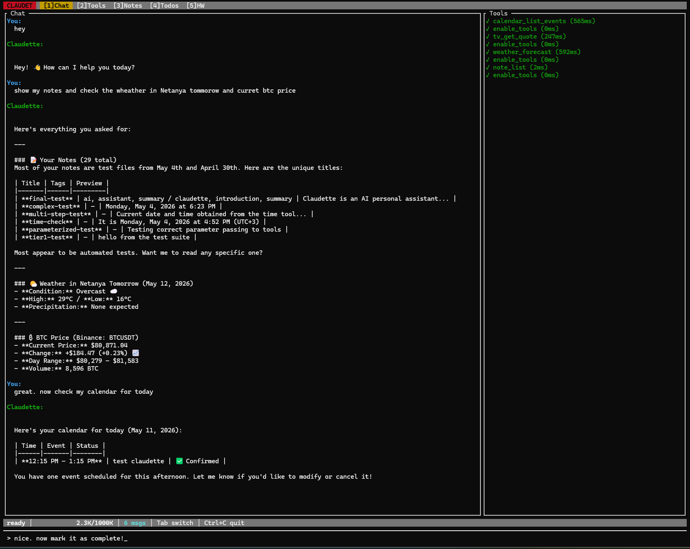

# Claudette

**Your AI never leaves your laptop.** Claudette is a **local-first, air-gapped** personal AI assistant *and* coding agent that runs entirely on your own hardware — REPL, fullscreen TUI, one-shot CLI, and a Telegram bot, all driving one local model through [Ollama](https://ollama.com) or [LM Studio](https://lmstudio.ai/). No cloud brain. No API key. No subscription. No [telemetry](PRIVACY.md). One Rust binary.

> **Pull a model, unplug the network, and she still works.** The whole core — chat, notes, todos, file editing, code search, repo work, even the autonomous code-change pipeline — runs with zero internet. With `--offline` the air-gap is *enforced*, not just configured. See [Air-gapped by design](#-air-gapped-by-design).
>
> And she helps build herself: Claudette opens real pull requests against her own source tree — [she's a listed contributor on this repo](https://github.com/mrdushidush/claudette/graphs/contributors). See [She helps build herself](#-she-helps-build-herself).

[](https://crates.io/crates/claudette)
[](https://github.com/mrdushidush/claudette/actions/workflows/ci.yml)
[](#license)
[](https://www.rust-lang.org)
[](PRIVACY.md)
[](#-air-gapped-by-design)



> One turn driving four tool groups (`note_list`, `weather`, `tv_get_quote`, `calendar_list_events`) — the model enables groups on demand and dispatches the calls. TUI tabs: `[1]Chat [2]Tools [3]Notes [4]Todos [5]HW`.

---

## Install in 30 seconds

**Linux / macOS:**

```sh
curl -fsSL https://raw.githubusercontent.com/mrdushidush/claudette/main/install.sh | sh
```

**Windows (PowerShell):**

```powershell
iwr -useb https://raw.githubusercontent.com/mrdushidush/claudette/main/install.ps1 | iex
```

Then pull a brain and talk:

```sh
ollama pull qwen3.5:4b           # 3.4 GB brain — one-time download
claudette "what time is it?"
```

> **Prefer not to pipe the network into a shell?** Grab a prebuilt archive from [Releases](https://github.com/mrdushidush/claudette/releases/latest) and drop `claudette` (or `claudette.exe`) onto your `PATH`. Every artifact ships a SHA256 sidecar so you can verify the download wasn't corrupted in transit.
>
> **Rust user?** `cargo install claudette`.
> **No GPU?** The 4B brain runs on plain CPU — slower, but it works. See [CPU-only mode](docs/hardware.md#no-gpu-cpu-only-mode).
> **First time?** [`docs/show-me.md`](docs/show-me.md) is plain-English examples — calendar, notes, weather, screenshots, voice from your phone.

---

## 🔒 Air-gapped by design

Most "local AI" tools quietly phone home — telemetry, model downloads, a cloud fallback when the local model struggles. **Claudette has no such path.** There is no cloud-brain code in the binary to begin with.

- **One required dependency:** a model server (Ollama or LM Studio) on `localhost`. That's it.
- **`--offline` *enforces* the air-gap.** Run `claudette --offline` (or set `CLAUDETTE_OFFLINE=1`) and every outbound call except the local model backend + loopback is hard-blocked with a clear "blocked by offline mode" error — web search/fetch, Gmail/Calendar, markets/weather/Wikipedia, GitHub, Telegram, and remote `git push`/`clone` all refuse. The brain and recall keep working. `claudette --offline --doctor` prints the exact allow-list. This is the difference between *configured* not to phone home and *can't* phone home.
- **Every outbound call is opt-in and feature-gated** even without `--offline` — voice TTS, Telegram, web search, GitHub, Google Calendar/Gmail. Each one only exists if *you* turn it on with a token. The full inventory of every place a byte could leave your machine is in [`PRIVACY.md`](PRIVACY.md).
- **Truly offline:** `CLAUDETTE_SKIP_OLLAMA_PROBE=1` skips even the localhost startup check. Pull your model, disconnect the network, and the entire core works — chat, notes, todos, files, code search, repo editing, and the [Forge](#-forge-mode-an-autonomous-code-change-pipeline) autonomous code-change pipeline.
- **Nothing is written outside `~/.claudette/`** without an explicit permission prompt.

If you work on a regulated, classified, or simply trust-no-cloud machine, this is the headline feature — not an afterthought. Your code and your conversations never touch someone else's servers — and with `--offline`, they *can't*.

---

## Why Claudette

The open-source agent space is crowded with cloud-API coding tools. Claudette aims at a different slot: **a general-purpose assistant *and* a capable coding agent that run entirely on your own hardware, with no cloud brain in the loop.**

- **Private by construction.** Not "private mode" — there is no other mode. See above.
- **Fits real hardware.** The default `qwen3.5:4b` brain uses ~3.4 GB VRAM and runs on an 8 GB GPU or plain CPU. Step up to `qwen3.6-35b-a3b` on a 16 GB GPU for near-frontier quality. No hidden 32 GB-VRAM requirement.
- **Personal, not just code.** Calendar, Gmail, scheduler/briefings, notes, todos, markets, weather, web search — code generation is *one* capability, not the whole product.
- **Messaging-first.** A first-class Telegram bot with voice in (Whisper) and voice out (edge-tts) — drive the whole agent from your phone at a bus stop.
- **Honest about itself.** Side-by-side vs. OpenHands, Aider, opencode, Cline, Continue: [`docs/comparison.md`](docs/comparison.md). Claudette doesn't win every column — it's the only one built for *this* slot.

---

## What she can do

### Four interfaces, one local brain
| Mode | Command | What it's for |
|------|---------|---------------|
| **REPL** | `claudette` | Conversational shell. Autosaves every turn. |
| **One-shot** | `claudette "your question"` | Print a reply and exit. Pipe-friendly. |
| **TUI** | `claudette --tui` | Ratatui fullscreen UI, 5 tabs, live tool panel. |
| **Telegram bot** | `claudette --telegram` | Voice-capable remote chat from your phone. |

### 80+ tools, ~200-token base schema
Almost every tool lives in a **group the model opts into** via `enable_tools(group)`, so the prompt stays tiny until the surface is actually needed. **22 groups:** notes, todos, files, code, meta, git, ide, search, advanced, facts, registry, github, markets, telegram, calendar, schedule, gmail, recall, **quality** (`run_tests` / `diagnostics` / `apply_patch`), **semantic** (`semantic_grep`), **vision** (`screenshot_capture` / `image_describe`), and **clipboard**. Point Claudette at a repo (`CLAUDETTE_WORKSPACE`) and the lean coding core (Files + Search + Advanced + Quality) is pre-enabled so she can read, edit, search, and run tests immediately.

### 🛠️ Forge-mode: an autonomous code-change pipeline
`claudette --forge "<prompt>"` runs a **Planner → Coder → Verifier → fix-loop → Submitter** sequence against a git repo. Two things make it trustworthy enough to leave running: the **Verifier builds and tests for real** each round (`cargo check`/`cargo test`, plus `go`/`pytest`/`npm` equivalents) so a diff that doesn't compile or breaks a test can't pass, and a **human-review gate** shows you the plan + full diff and waits for your `y` before any PR is opened. Inside an existing repo it auto-bootstraps an ephemeral mission at the repo root — no clone needed. Roles are independently routable, so you can pin a stronger model to the Verifier and a cheap one to the Coder. Full walkthrough: [`docs/forge.md`](docs/forge.md).

### 🌿 Brownfield missions: clone, edit, ship a PR in one chain
`mission_start("owner/repo")` clones into `~/.claudette/missions/<slug>/` and transparently re-routes `git_status` / `glob_search` / `grep_search` / `write_file` / `bash` into the mission tree. `mission_submit` auto-branches, commits, pushes, and opens the PR. Resumable across sessions with `mission_state(action="attach")`.

### 🔁 She helps build herself
Claudette is developed **with Claudette.** She runs her own [Forge](#-forge-mode-an-autonomous-code-change-pipeline) + brownfield pipeline against her *own* source tree to implement changes, clears the real build-and-test gate (`cargo fmt` / `clippy -D warnings` / `cargo test`) before anything is pushed, and opens genuine pull requests under her own git identity — so she shows up as a [listed contributor on this very repo](https://github.com/mrdushidush/claudette/graphs/contributors). Features authored and merged this way include `repo_map` language support (C#, Java), `read_file tail=N`, and `grep_search count_only`.

This is the honest version of "self-evolving": **she does the implementation, you keep the keys.** Every change still passes the [human-review gate](#-forge-mode-an-autonomous-code-change-pipeline) and is merged by a person — never an unattended commit to `main`. The agent that edits, tests, and ships code is the same one you point at your *own* repos, so the dogfooding is the demo.

### 🧠 Tiered-brain auto-fallback
Three presets — Fast / Auto / Smart. Auto runs `qwen3.5:4b` and escalates to `qwen3.5:9b` only on real stuck signals (empty response after retry, max-iterations with no text, ≥3 consecutive tool errors), reverting per-turn rather than sticking. On a 16 GB GPU, pin `qwen3.6-35b-a3b` instead — see [Claudette Certified](#-claudette-certified--the-local-model-benchmark).

### 🎙️ Voice in, voice out, vision in
Whisper transcription for Telegram voice notes, edge-tts replies (English or Hebrew), and image attachments in TUI/REPL via Alt+V (clipboard), drag-drop, or `@/path/to/img.png` — when the loaded brain is multimodal.

### ⚙️ Codet sidecar for code generation
`generate_code` routes through a dedicated coder model (default `qwen3-coder:30b`), runs a real syntax check across 4 languages (Python `py_compile`, `rustc --emit=metadata`, JavaScript + TypeScript via `tsc --noEmit`), then an Aider-style SEARCH/REPLACE fix loop on failure, then optional pytest / cargo-test / jest. Hot-swaps into VRAM on demand on memory-constrained boxes.

### 🔎 Cross-session semantic recall
`/recall <query>` searches every past conversation turn across sessions via a local embedding index, dropping the relevant fragments straight into the current context.

### 🤝 Sub-agents
`spawn_agent` delegates to a Researcher (web + file + code search), GitOps (rebase/squash/push), or Code Reviewer (read-only). Only the final answer comes back — sub-agent chatter never pollutes the main context.

### 🛡️ Per-tool permission gating
ReadOnly and WorkspaceWrite tools auto-allow; DangerFullAccess (`bash`, `edit_file`, `git add/commit/push`, cross-org PRs) prompts `[y/N]` every time. Telegram default-denies DangerFullAccess (no TTY to confirm at).

---

## 🏅 Claudette Certified — the local-model benchmark

A local agent is only as good as the model behind it, and "which model should I run?" is the question every new user asks. So we answer it with data, not vibes — and `claudette --doctor` answers it **for your specific GPU**: it detects VRAM (`nvidia-smi`, falling back to `CLAUDETTE_VRAM_GB`) and recommends the certified model for that tier with the exact load command.

**Every candidate brain runs the same objective 50-task battery** — 11 languages/surfaces (Rust, Python, JS, TS, Go, shell, HTML, CSS, SQL, a large real repo, git) × 12 task types (bugfix, add-feature, multi-file, refactor, create-file, explain, locate, enumerate, run-tests, debug-error, git-workflow, answer-from-codebase) — through Claudette's *real* tool loop, then an automated verifier checks the result (build/test passes, the file is correct, or ground-truth tokens appear in the transcript). **No model grades itself.** All runs below: **24k context, `--parallel 1`, RTX 5060 Ti 16 GB** (2026-05-30). The harness is reusable and lives at [`runs/eval-2026-05-29/battery/`](runs/eval-2026-05-29/battery/) — bring your own model.

| Brain | Quant | VRAM | Pass @ 50 | Wall | Best for |
|-------|-------|------|-----------|------|----------|
| **`qwen3.6-35b-a3b`** | `q3_k_xl` | 16 GB (MoE offload) | **92%** | 38 min | **Best accuracy** — the daily-driver default |
| `qwen3.5-4b` | Q4–Q8 | **8 GB** | 90% | **8 min** | **Best value** — runs on almost any GPU |
| `qwen3.5-9b` | Q4 | 11 GB | 88% | 16 min | Solid mid-tier |
| `qwen3.6-35b-a3b` | `q4_k_xl` | 24 GB (spills at 16) | 88% | 48 min | More precision, but RAM-bound on 16 GB → timeouts |
| `gpt-oss-20b` | MXFP4 | 13 GB (resident) | 86% | **5 min** | **Fastest** — fully in-VRAM, coolest |
| `granite-4.1-8b` | Q4–Q6 | 9 GB | 78% | 17 min | Reliable tool-calling, weaker raw coder |

> **Not ranked — `qwen3.6-27b` (dense), incomplete run.** Its sweep was cut short when the model unloaded partway through (the dense 27b runs hot, ~72 °C, and got evicted): the 12 hardest tasks — all 8 large-repo + 4 git-workflow — never actually executed (they log a 0-second `HTTP 400 "No models loaded"`, i.e. an infrastructure halt, not a real attempt). So there is **no comparable `/50` to rank it by** — a score over only the ~38 tasks that ran isn't apples-to-apples with the full-50 numbers above, so we leave it out rather than flatter it. It held up fine on what it did run, but it's the slow dense "precision" tier regardless (~67 s/task — accurate, not interactive). Raw per-task rows: [`SCORES-qwen36-27b.tsv`](runs/eval-2026-05-29/battery/SCORES-qwen36-27b.tsv).

**The lessons that shaped the recommendations:**

1. **Fitting in VRAM beats parameter count.** `q3_k_xl` (fits 16 GB) *beats* `q4_k_xl` (spills to RAM → ~20% slower → loses tasks to timeouts) despite lower precision. On 16 GB, pick **`q3_k_xl`**.
2. **Small models punch up.** A 4B model hits 90% in 8 minutes and runs on an 8 GB GPU — the value/accessibility star.
3. **Chat-template compatibility is the #1 local-model failure mode.** `gemma-4-26b` and `qwen3-coder-30b` stock GGUFs return HTTP 400 on tool calls in LM Studio's template engine; `glm-4.7-flash` narrated prose instead of emitting tool calls. **Always pull a `lmstudio-community` / `unsloth` repack and validate one real tool call before trusting a model.**
4. **Thermals follow architecture, not size.** MoE brains keep the GPU ~55 °C at any size; the dense `qwen3.6-27b` runs hot (72 °C) — it's the slow precision tier, not for sustained interactive use.

Full per-task data and reasoning notes: [`runs/eval-2026-05-29/battery/MODEL-COMPARISON.md`](runs/eval-2026-05-29/battery/MODEL-COMPARISON.md). The next batch of candidates queued for certification (GLM-4.7-Flash, Qwen3-Coder-30B, Granite-4.1-8B, Mistral/Ministral, and more) is in [`CANDIDATES.md`](runs/eval-2026-05-29/battery/CANDIDATES.md) — **this is one of the best ways to contribute** (see [Roadmap](#-roadmap)).

> `qwen3.6-35b-a3b` is distributed via [LM Studio](https://lmstudio.ai/) (Unsloth GGUF) rather than packaged on Ollama. Flip the backend with `CLAUDETTE_OPENAI_COMPAT=1` and pin the quant explicitly (`CLAUDETTE_MODEL=qwen3.6-35b-a3b@q3_k_xl`) — LM Studio picks the smallest match otherwise. Recipe in [`docs/power-user.md`](docs/power-user.md#lm-studio-or-any-openai-compatible-server).

---

## Hardware

The numbers describe the *comfortable* setup. **You don't need a GPU** — Ollama runs on plain CPU (slower, but viable for a 1B/3B/4B brain). See [`docs/hardware.md#no-gpu-cpu-only-mode`](docs/hardware.md#no-gpu-cpu-only-mode).

| Component | Comfortable minimum | Recommended | Tested on |
|-----------|---------------------|-------------|-----------|
| GPU | 6 GB VRAM (or CPU-only with a smaller brain) | 8 GB VRAM (16 GB for the 35b brain) | RTX 5060 Ti 16 GB |
| RAM | 16 GB | 32 GB | 32 GB DDR4 |
| Disk | ~3 GB (brain only) | ~27 GB (brain + fallback + 30b coder) | NVMe SSD |
| OS | Windows 10+, Linux, macOS | Windows 11 / Ubuntu 24.04 / macOS 14+ | Windows 11 Pro |

Full model-footprint table, CPU-only recipes, and the 30b-coder-on-8GB-VRAM env recipe: [`docs/hardware.md`](docs/hardware.md).

---

## Quick start (full setup)

```bash
# 1a. Default path — Ollama with the 3.5 family (works on 8 GB VRAM, or CPU).
ollama pull qwen3.5:4b           # brain (default Auto preset)
ollama pull qwen3.5:9b           # fallback brain (optional)
ollama pull qwen3-coder:30b      # Codet coder — only if you'll use generate_code

# 1b. Recommended path — LM Studio with qwen3.6 (best on 16 GB+ VRAM).
# Pull `qwen3.6-35b-a3b` inside LM Studio, then in ~/.claudette/.env:
#   CLAUDETTE_OPENAI_COMPAT=1
#   OLLAMA_HOST=http://localhost:1234
#   CLAUDETTE_MODEL=qwen3.6-35b-a3b@q3_k_xl
#   CLAUDETTE_CODER_MODEL=qwen3.6-35b-a3b@q3_k_xl
# Full LM Studio recipe: docs/power-user.md

# 2. Install Claudette — pick one.
curl -fsSL https://raw.githubusercontent.com/mrdushidush/claudette/main/install.sh | sh   # Linux/macOS
iwr -useb https://raw.githubusercontent.com/mrdushidush/claudette/main/install.ps1 | iex  # Windows
cargo install claudette                                                                    # Rust users
cargo install claudette --no-default-features                                              # coding-only: no Google/Telegram code compiled in

# 3. (Optional) Tokens for opt-in tools that reach the network.
export BRAVE_API_KEY=...         # web_search
export GITHUB_TOKEN=ghp_...      # github group
export TELEGRAM_BOT_TOKEN=...    # --telegram mode

# 4. Run.
claudette                        # REPL
claudette --tui                  # TUI
claudette "what time is it?"     # one-shot
claudette --forge "fix the failing test in src/parser.rs"   # autonomous pipeline
claudette --resume               # resume last session
claudette --telegram             # Telegram bot
claudette --doctor               # diagnose model server, models, tokens, permissions
```

First launch auto-creates `~/.claudette/` and probes `http://localhost:11434`. Going fully offline? `CLAUDETTE_SKIP_OLLAMA_PROBE=1`.

Out of the box (no tokens, no network): notes, todos, files, time, code search, repo editing, forge. Brave / GitHub / Google Calendar / Gmail tools light up when you set the relevant token — full table in [`docs/configuration.md`](docs/configuration.md).

---

## 🚀 Roadmap

Claudette has a clear north star: **be the most private, most universally-runnable local code assistant in the world.** Here's where she's headed — and these are exactly the places a new contributor can leave a mark.

### The vision

- **🔒 Hardened air-gap mode.** The enforced egress kill-switch has **shipped** — [`--offline` / `CLAUDETTE_OFFLINE=1`](#-air-gapped-by-design) hard-blocks every network call except the local backend + loopback. Still ahead: a reproducible offline install bundle (binary + model + Whisper weights) and a documented "regulated-machine" deployment story, plus an outbound-host audit log.
- **🧠 A model-agnostic, curated brain menu.** Not one blessed model — a recommendation for *every* hardware tier, from a 4 GB laptop GPU to a 24 GB workstation, so anyone can run her well on what they already own.
- **🏅 The Claudette Certified program, expanded.** Keep running the objective [50-task battery](#-claudette-certified--the-local-model-benchmark) on every promising new local model and publish a living, badged recommendation table. The [candidate queue](runs/eval-2026-05-29/battery/CANDIDATES.md) is already scouted — GLM-4.7-Flash, Qwen3-Coder-30B, Granite-4.1-8B, the Mistral/Ministral family, and more.

### Where you come in 🙌

New contributors welcome — these are real, scoped, high-impact ways to help:

- **🏅 Certify a model.** Have a GPU and a model we haven't benched? Run the reusable battery at [`runs/eval-2026-05-29/battery/`](runs/eval-2026-05-29/battery/) and open a PR with the scores. This is the single most valuable contribution right now and needs no Rust.
- **📦 Rescue a template.** `gemma-4-26b`, `qwen3-coder-30b`, and `glm-4.7-flash` are strong models gated only by broken stock chat templates. Find/build a working `lmstudio-community`/`unsloth` GGUF, validate one tool call, and document the fix.
- **⚙️ Sharpen the coder.** Route trivial create-file requests straight to `write_file` so they don't race the `generate_code` timeout; widen the syntax-check language set; improve the SEARCH/REPLACE fix loop.
- **🛡️ Grow the security-review stage.** The Forge security scanner is line-based on diff additions — extend its rule coverage (multi-line sinks, SSRF, path traversal, prototype pollution) and shrink false positives.
- **🎙️ Extend voice & vision.** More TTS languages, better multimodal image handling, richer Telegram voice flows.
- **📚 Tell the story.** Tutorials, a homelab/Pi deploy guide, screencasts — `docs/show-me.md` is where the new-user journey lives.

Known open items live on the issue tracker, including the current [Dependabot advisories](https://github.com/mrdushidush/claudette/security/dependabot). Start at [`CONTRIBUTING.md`](CONTRIBUTING.md), grab a thread above, and say hi in an issue.

---

## Docs

- [`docs/show-me.md`](docs/show-me.md) — **start here:** plain-English example prompts (notes, calendar, vision, voice, code)
- [`docs/quickstart.md`](docs/quickstart.md) — 30-second start, common flows
- [`docs/configuration.md`](docs/configuration.md) — every env var, token file fallbacks, recall settings
- [`docs/power-user.md`](docs/power-user.md) — LM Studio recipe, brain pinning, forge knobs, context tuning
- [`docs/hardware.md`](docs/hardware.md) — VRAM/RAM/disk by preset, CPU-only mode, 30b-on-8GB env recipe
- [`docs/usage.md`](docs/usage.md) — CLI flags, slash commands, Telegram-only commands
- [`docs/architecture.md`](docs/architecture.md) — module layout, tool-group contract, Codet sidecar contract
- [`docs/forge.md`](docs/forge.md) — forge-mode pipeline, Submitter contract, `models.toml` schema, auto-bootstrap
- [`docs/comparison.md`](docs/comparison.md) — honest side-by-side vs. opencode / Aider / OpenHands / Cline / Continue
- [`docs/google_setup.md`](docs/google_setup.md) — Calendar + Gmail OAuth walkthrough
- [`docs/deploy.md`](docs/deploy.md) — Pi / VPS / home-server deploy via docker-compose
- [`editor/vscode/`](editor/vscode/README.md) — VS Code extension (REPL / TUI / forge / "ask about selection")
- [`PRIVACY.md`](PRIVACY.md) — every place data can leave your machine, and the conditions for each

---

## Storage layout

```
~/.claudette/
├── notes/            # Markdown notes (ISO-timestamped, optional tags)
├── files/            # Sandboxed scratch dir for write_file/generate_code
├── sessions/         # Auto-saved + named sessions
├── secrets/          # Token files (github.token, telegram.token, brave.token, …)
├── missions/         # Brownfield mission clones
├── models/           # Whisper model (download separately)
├── recall.sqlite     # Cross-session semantic-recall index
├── todos.json        # Task list
├── models.toml       # Optional model-config overlay
├── fallback.jsonl    # Auto-fallback event log
├── .env              # Persistent env-var overrides
└── CLAUDETTE.MD      # Optional user memory (800-char cap)
```

Nothing outside `~/.claudette/` is written without an explicit permission prompt.

---

## Build from source

```bash
git clone https://github.com/mrdushidush/claudette
cd claudette
cargo build --release -p claudette
./target/release/claudette --help
```

**1,000+ tests passing.** Before committing: `cargo fmt --all && cargo clippy --all-targets --no-deps -- -D warnings && cargo test --lib`.

---

## Contributing

See [`CONTRIBUTING.md`](CONTRIBUTING.md), and the [Roadmap](#-roadmap) above for high-impact starting points. Quick version:

- File bugs at <https://github.com/mrdushidush/claudette/issues>.
- Conventional Commits: `feat:`, `fix:`, `docs:`, `refactor:`, `test:`, `chore:`, `style:`, `ci:`.
- By contributing, you agree your work is dual-licensed under MIT OR Apache-2.0.

Security issues: please use the private advisory flow in [`SECURITY.md`](SECURITY.md) — don't open a public issue.

Be kind — [`CODE_OF_CONDUCT.md`](CODE_OF_CONDUCT.md) has the short version.

---

## License

Dual-licensed under either of:

- **MIT** — see [`LICENSE-MIT`](LICENSE-MIT)
- **Apache License 2.0** — see [`LICENSE-APACHE`](LICENSE-APACHE)

at your option. Use, modify, redistribute commercially or personally. The Apache option adds an explicit patent grant; neither grants a trademark — don't imply endorsement.

Unless you explicitly state otherwise, any contribution intentionally submitted for inclusion in the work by you, as defined in the Apache-2.0 license, shall be dual-licensed as above, without any additional terms or conditions.

Copyright © 2026 [mrdushidush](https://github.com/mrdushidush).
