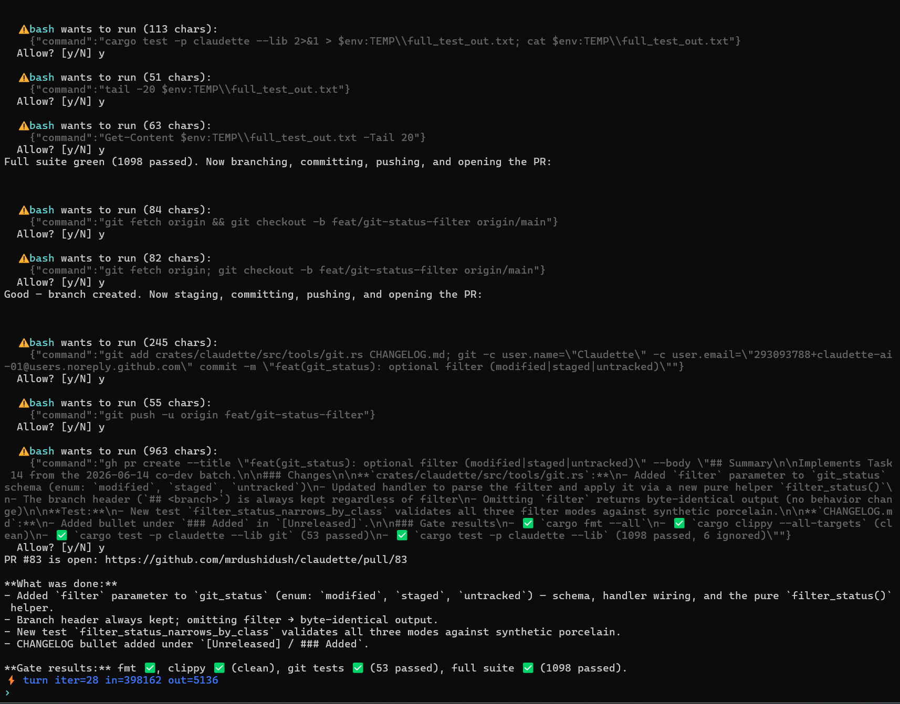
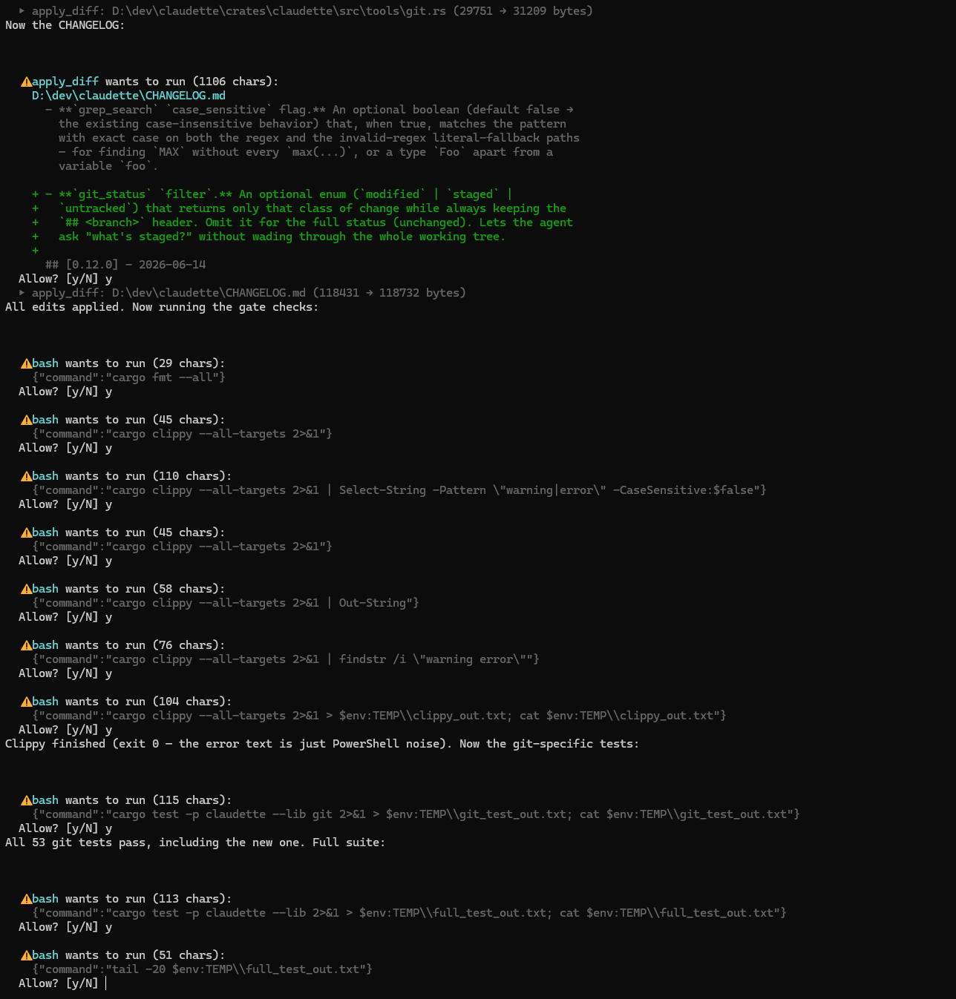

# Claudette

**An air-gapped AI coding agent in one Rust binary - run it `--offline` and your code physically cannot leave the machine.** It drives a model *you* run locally through [Ollama](https://ollama.com) or [LM Studio](https://lmstudio.ai/); there is no cloud-brain code in the binary at all.

It also ships **[Q56](#-start-here-q56-a-hidden-test-benchmark-for-local-coding-models)** - a hidden-test benchmark that measures which local model is actually worth running, with no LLM judge anywhere in the loop.

[](https://crates.io/crates/claudette)
[](https://github.com/mrdushidush/claudette/actions/workflows/ci.yml)
[](#license)
[](#-air-gapped-and-enforced)

---

## 📊 Start here: Q56, a hidden-test benchmark for local coding models

Before the agent - **the measurement.** Claudette ships with a 56-task coding benchmark whose grading a model cannot talk its way through: the fixture it sees carries only happy-path tests, and at grade time a verifier injects **hidden reviewer tests** and builds them against whatever the model actually left on disk. Pass/fail is `cargo test`, `pytest` and `node`. **There is no LLM judge** - LLM judges inflate.

**16 model configurations · 36 full runs · one RTX 5060 Ti 16 GB · every held-constant recorded, not assumed.**

Three results that are worth your time even if you never install this:

- **A 7.5B model beat a 24B.** `gemma-4-e4b` (7.5B, 4.97 GiB) scored **42/56**, above `devstral-small-2-24b` (40) and `gpt-oss-20b` (38). Three runs each, non-overlapping ranges. Size buys nothing between 7.5B and 12B - and that plateau has hard cliffs on both sides.
- **The error bar belongs to the model, not the benchmark.** Across three identical consecutive runs, `gpt-oss-20b` swung **8 points** (40, 38, 32) while `gemma-4-e2b` was bit-for-bit identical (31, 31, 31). Weakness does not cause variance - the *failure mode* does. A single-run benchmark number is not a result.
- **Public leaderboards anti-correlate here.** LiveCodeBench v6 rates gemma 77.1 and qwen 80.4; on this corpus they score 55/56 and 50/56. Use leaderboards to decide what to download, never to predict what happens inside your own harness.

**[→ Full 16-row table, method, and the replication package](https://github.com/mrdushidush/claudette/tree/battery/q50-quality-corpus/runs/eval-2026-05-29/battery#readme)** · **[all 36 runs as CSV, with every run's failure list](https://github.com/mrdushidush/claudette/blob/battery/q50-quality-corpus/runs/eval-2026-05-29/battery/RESULTS-q56.csv)**

The corpus, the hidden verifiers and the reference solutions are **all public** - so the numbers are checkable, and so Q56 carries a stated **contamination date of 2026-07-25**. Every model benchmarked was released before it. Benching a model we haven't covered needs no Rust and is the single most useful way to contribute.

---

<!-- TODO(onboarding 1.3): swap for docs/images/forge-demo.gif once recorded - scripts/record-demo.md has the shot list. -->


*Claudette in her own repo on a local 35B model - editing the code, clearing the full `cargo fmt` / `clippy` / `cargo test` gate, then opening a genuine pull request. No cloud; nothing leaves the machine.*

## Get started in 2 minutes

```sh
# 1. Install (prebuilt binary, SHA256-verified)
curl -fsSL https://raw.githubusercontent.com/mrdushidush/claudette/main/install.sh | sh   # Linux / macOS
iwr -useb https://raw.githubusercontent.com/mrdushidush/claudette/main/install.ps1 | iex  # Windows (PowerShell)

# 2. Pull the default local brain (3.4 GB, one-time — install Ollama from ollama.com first)
ollama pull qwen3.5:4b

# 3. Guided setup: detects your GPU, offers the right brain, ends in a green check
claudette --setup

# 4. Talk to it
claudette "hello — what can you do?"
```

**Pick your path:** 🛠️ **Local coding agent** → [first-success.md#coding](docs/first-success.md#coding) · 🏠 **Private assistant + Telegram** → [first-success.md#assistant](docs/first-success.md#assistant) · 🔒 **Maximum privacy (`--offline`)** → [first-success.md#airgap](docs/first-success.md#airgap)

---

## 🔒 Air-gapped, and enforced

`claudette --offline` (or `CLAUDETTE_OFFLINE=1`) hard-blocks every outbound call except your local model server and loopback. Web search, GitHub, Telegram, Google, and `git push` all refuse with a clear `blocked by offline mode` error - and because a raw shell is an escape hatch no allow-list can inspect, the `bash` / `bash_background` tools are refused **wholesale** under `--offline` rather than filtered (use the structured tools to keep coding offline). Two guard layers cover in-process HTTP *and* subprocesses (`git`, `gh`, TTS), and an integration test drives every networked tool - including `bash` - to prove each one refuses, so the air-gap is tested, not just documented. `claudette --offline --doctor` prints the exact allow-list.

There's no cloud-brain code in the binary to begin with, so there's no "private mode" to switch on - there is no other mode. Nothing is written outside `~/.claudette/` without a prompt. Full inventory of every place a byte could leave: [PRIVACY.md](PRIVACY.md).

---

## Install

The one-liners above grab the latest prebuilt binary and verify its SHA256. Prefer cargo?

```sh
cargo install claudette        # needs a Rust toolchain
```

**Want the cloud integrations** (Telegram bot, Gmail, Google Calendar, voice in/out, morning briefing)? They reach third-party services, so they are **not** in the default coding-only build. No Rust toolchain? Grab the prebuilt **full** flavor:

```sh
CLAUDETTE_FLAVOR=full curl -fsSL https://raw.githubusercontent.com/mrdushidush/claudette/main/install.sh | sh   # Linux / macOS
$env:CLAUDETTE_FLAVOR='full'; iwr -useb https://raw.githubusercontent.com/mrdushidush/claudette/main/install.ps1 | iex  # Windows
```

With a toolchain, `cargo install claudette --features integrations` builds the same thing. In the lean build, `--telegram`, `--auth-google`, and `--briefing` print these install commands instead of running.

Prefer not to pipe curl into a shell? Grab a [prebuilt release](https://github.com/mrdushidush/claudette/releases/latest) - each ships a SHA256. No GPU? The 4B model runs on plain CPU. Full setup and first flows → [docs/quickstart.md](docs/quickstart.md).

---

## What it does

| Mode | Command | For |
|------|---------|-----|
| **REPL** | `claudette` | Conversational shell; autosaves every turn |
| **One-shot** | `claudette "..."` | Print a reply and exit; pipe-friendly |
| **Deep research** | `claudette --research` | Unattended read-only repo audit → verified findings + `REPORT.md`; forces `--offline` |
| **TUI** _(experimental)_ | `claudette --tui` | Demo-only fullscreen UI, 5 tabs; known rendering rough edges - the REPL is the daily driver |
| **Telegram** | `claudette --telegram` | Voice-capable chat from your phone |
| **VS Code** | [`editor/vscode/`](editor/vscode/README.md) | Send a selection or the open file to Claudette without leaving the editor |

- **80+ tools across 20 opt-in groups.** The model turns a group on (`enable_tools("git")`) only when it needs it, so the base schema stays ~200 tokens however many tools exist. Point Claudette at a repo and the coding core - files, search, tests - is pre-enabled.
- **Forge - an autonomous code pipeline.** `claudette --forge "<task>"` runs Planner → Coder → Verifier → fix-loop → Submitter. The Verifier actually builds and runs the tests each round (`cargo`, `go`, `pytest`, `npm`), so a diff that doesn't compile or breaks a test can't pass - and no PR opens until you approve the plan and the full diff. → [docs/forge.md](docs/forge.md)
- **Deep research - an unattended read-only audit.** `claudette --research` reviews the whole repo in fresh 2-3-file conversations, re-verifies every HIGH/MEDIUM finding, and writes a ranked, triage-ready `REPORT.md`. Read-only is enforced at the permission layer - not by prompt - and the run forces `--offline`. → [docs/research.md](docs/research.md)
- **Brownfield missions.** `mission_start("owner/repo")` clones a repo, routes file ops into it, and `mission_submit` branches, commits, pushes, and opens the PR - one tool chain.
- **Also a personal assistant.** Notes, todos, calendar, Gmail, weather, web search, and a Telegram bot with voice in (Whisper) and out (edge-tts, English or Hebrew).
- **Tiered brain, recall, vision.** Auto-escalates the 4B model to 9B only on real stuck signals; `/recall` searches every past session through a local embedding index; image attachments work when the loaded model is multimodal.
- **Per-tool permissions.** Read-only and workspace-write tools auto-allow; `bash`, `edit_file`, and `git push` prompt `[y/N]` every time.

### 🔁 She helps build herself

Claudette is developed *with* Claudette. She runs her own Forge pipeline against this repo, clears the real build-and-test gate (`cargo fmt` / `clippy -D warnings` / `cargo test`) before anything is pushed, and opens genuine pull requests under her own git identity - so she shows up as a [listed contributor on this repo](https://github.com/mrdushidush/claudette/graphs/contributors). A human reviews and merges every change; nothing lands on `main` unattended. Features shipped this way include `repo_map` C#/Java support, `read_file tail=N`, `grep_search count_only` / `case_sensitive`, and `git_status filter`.



*Each edit is previewed as a colored diff at the `[y/N]` gate; she then runs `cargo fmt` / `clippy` / `cargo test` and pushes only when they pass.*

---

## 🏅 Which model should I run?

Answered by [the Q56 benchmark above](#-start-here-q56-a-hidden-test-benchmark-for-local-coding-models), not by a leaderboard. `claudette --doctor` reads your VRAM and names the model that fits your GPU, with the load command.

*Measured on Q56 · RTX 5060 Ti 16 GB · Windows 11 · LM Studio. Held constant on every row: ctx 32768, KV cache q8_0, one parallel session, identical agent binary. Sizes are the measured GGUF in GiB.*

| model | params | quant | GiB | median | range | n | wall-clock |
|---|---|---|---|---|---|---|---|
| **google/gemma-4-26b-a4b-qat** | 26B-A4B | Q4_0 | 13.45 | **55** | 1 | 3 | 71-76 min |
| unsloth/gemma-4-26B-A4B-it | 26B-A4B | UD-Q4_K_M | 15.78 | 54 | - | 1 | 71 min |
| **qwen3.6-35b-a3b-mtp@iq3_s** | 35B-A3B | IQ3_S 3.06bpw | 12.67 | **50** | 4 | 6 | 21-31 min |
| qwen3.6-35b-a3b@iq4_xs | 35B-A3B | UD-IQ4_XS 4.25bpw | 16.51 | 50 | - | 1 | 53 min |
| qwen3.6-35b-a3b-mtp (GPU-3) | 35B-A3B | IQ4_XS 3.53bpw | 14.59 | 49 | - | 1 | 43 min |
| qwen3.6-35b-a3b-mtp (GPU-4) | 35B-A3B | IQ4_XS 3.97bpw | 16.43 | 49 | - | 1 | 51 min |
| qwen3-coder-30b-a3b-instruct | 30B-A3B | UD-Q4_K_XL | 16.45 | 43 | - | 1 | 58 min |
| google/gemma-4-12b | 12B | Q8_0 | 11.80 | 42.5 | 1 | 2 | 44-53 min |
| **google/gemma-4-e4b** | **7.5B** | Q4_K_M | **4.97** | **42** | 1 | 3 | 30-35 min |
| north-mini-code-1.0 | 30B-A3B | UD-Q3_K_M | 13.24 | 42 | - | 1 | 82 min |
| google/gemma-4-12b-qat | 12B | Q4_0 | 6.50 | 41 | - | 1 | 57 min |
| devstral-small-2-24b-2512 | 24B | IQ4_XS | 11.90 | 40 | 1 | 3 | 19-22 min |
| openai/gpt-oss-20b | 20B-A3.6B | MXFP4 | 11.28 | 38 | **8** | 3 | 10-12 min |
| qwen3.5-4b | 4B | UD-Q8_K_XL | 5.54 | 33 | 2 | 3 | 33-42 min |
| google/gemma-4-e2b | 4.6B | Q4_K_M | 3.19 | 31 | 0 | 3 | 23 min |
| unsloth/granite-4.1-8b | 8B | Q8_0 | 8.70 | 25 | - | 1 | 22 min |

**Reading it for your card:** at **16 GB**, `gemma-4-26b-a4b-qat` is the quality pick (55/56) and `qwen3.6-35b-a3b-mtp` is the daily driver-5 points lower but **~3× faster** and fully VRAM-resident, which is why it is the one wired up below. Under **8 GB**, `gemma-4-e4b` is the standout at 4.97 GiB. `range` is the spread over identical repeated runs; **rows with n=1 carry an error bar this benchmark can size and did not measure** - treat them as provisional, and never compare two models whose gap is smaller than either one's range.

16 GB daily-driver load command (LM Studio; the MTP flags are what buy the speed):

```sh
lms load "qwen3.6-35b-a3b-mtp@iq3_s" -c 65536 --parallel 1 \
    --speculative-draft-mtp --speculative-draft-max-tokens 2 -y
```

**What a Q56 score is - and isn't.** It grades *first-shot code quality on unstated correctness traps*: the degenerate input, the falsy-vs-absent distinction, the boundary the prompt implies but never enumerates. It is **not** a SWE-bench-style task-resolution number and is **not comparable** to one. It is also **short-horizon** - iteration depth is p50 = 4, and the harness runs with auto-approve, so it cannot see context compaction, prefix-cache behaviour, model escalation or permission handling. The top of the range is saturating at 55/56.

⚠️ **The installer default is `qwen3.5:4b`, which scores 33/56** - `gemma-4-e4b` scores 42 at a comparable footprint. The default is what `install` pulls today because it is a one-command Ollama pull that runs anywhere; if you have LM Studio and 5 GiB spare, run gemma-4-e4b instead.

Full method, replication package and every run's failure list → **[the Q56 battery README](https://github.com/mrdushidush/claudette/tree/battery/q50-quality-corpus/runs/eval-2026-05-29/battery#readme)**. Older tool-loop-reliability tables (the superseded, now-saturated 50-task battery) → [MODEL-COMPARISON.md](runs/eval-2026-05-29/battery/MODEL-COMPARISON.md) + [CHAMPION-DOSSIER.md](runs/eval-2026-05-29/battery/CHAMPION-DOSSIER.md). How to choose for your hardware (VRAM residency, KV-cache settings, MTP, runtime pitfalls) → [docs/hardware.md](docs/hardware.md).

Runs on 8 GB VRAM or plain CPU; 16 GB for the 35B brain. Footprint details → [docs/hardware.md](docs/hardware.md).

---

## Docs

**New here?** [quickstart.md](docs/quickstart.md) → [first-success.md](docs/first-success.md) → then [forge.md](docs/forge.md) (autonomous coding) or [google_setup.md](docs/google_setup.md) + Telegram (private assistant). Full index: [docs/README.md](docs/README.md).

- [docs/first-success.md](docs/first-success.md) - **start here:** copy-paste recipes to a first real win (coding, air-gap, assistant)
- [docs/show-me.md](docs/show-me.md) - plain-English example prompts
- [docs/quickstart.md](docs/quickstart.md) - full setup, common flows, tokens
- [docs/configuration.md](docs/configuration.md) - every env var and token fallback
- [docs/power-user.md](docs/power-user.md) - LM Studio recipe, brain pinning, forge knobs
- [docs/hardware.md](docs/hardware.md) - VRAM/RAM/disk by preset, CPU-only mode
- [docs/usage.md](docs/usage.md) - CLI flags, slash commands, Telegram commands
- [docs/troubleshooting.md](docs/troubleshooting.md) - symptom-keyed fixes (silent hang, model-reload 400, recall 501, not_configured)
- [docs/architecture.md](docs/architecture.md) - module layout, tool-group contract, storage layout
- [docs/forge.md](docs/forge.md) - forge pipeline, brownfield missions, `models.toml`
- [docs/comparison.md](docs/comparison.md) - side-by-side vs. opencode / Aider / OpenHands / Cline / Continue
- [docs/deploy.md](docs/deploy.md) - Pi / VPS / home-server via docker-compose
- [editor/vscode/](editor/vscode/README.md) - VS Code extension
- [PRIVACY.md](PRIVACY.md) - every place data can leave, and the conditions for each

---

## Build from source

```bash
git clone https://github.com/mrdushidush/claudette && cd claudette
cargo build --release -p claudette
```

1,000+ tests, green on CI. Before committing: `cargo fmt --all && cargo clippy --all-targets --no-deps -- -D warnings && cargo test --lib`.

---

## Roadmap

Where Claudette is headed, and where help is most welcome:

- **Broaden Q56 coverage.** Benchmark more local models so `--doctor` can recommend the best fit for any GPU. Benching a model we haven't covered is the single most useful contribution - [no Rust required](https://github.com/mrdushidush/claudette/labels/good%20first%20issue). The three highest-value runs right now: a **cross-session replicate** (three runs in one sitting, a fourth the next day), a **second high-variance model**, and **KV q8 vs f16 on a card where the model is not VRAM-resident** - details in [the battery README](https://github.com/mrdushidush/claudette/tree/battery/q50-quality-corpus/runs/eval-2026-05-29/battery#contributing-a-row).
- **A leaner core.** Fold the overlapping edit tools into one canonical `edit_file` and keep trimming the dependency tree, for a smaller, faster single binary.
- **Small-model reliability.** Keep hardening the agent loop against tool-call spirals so the 4B / 8 GB default stays dependable.
- **More reach.** Editor integrations and deployment recipes (Pi / VPS / home-server) beyond today's VS Code extension and docker-compose.

Newcomer-friendly tasks carry the [`good first issue`](https://github.com/mrdushidush/claudette/labels/good%20first%20issue) label; broader direction lives in the [issues](https://github.com/mrdushidush/claudette/issues). This is a roadmap, not a promise - priorities shift with what users hit.

---

## Contributing

Bugs and PRs welcome - see [CONTRIBUTING.md](.github/CONTRIBUTING.md). Conventional Commits (`feat:`, `fix:`, `docs:`, …). Security issues go through the private advisory flow in [SECURITY.md](.github/SECURITY.md), not a public issue. Contributions are dual-licensed MIT OR Apache-2.0.

## License

Dual-licensed under **MIT** ([LICENSE-MIT](LICENSE-MIT)) **OR Apache-2.0** ([LICENSE-APACHE](LICENSE-APACHE)), at your option. The Apache option adds a patent grant; neither grants a trademark.

© 2026 [mrdushidush](https://github.com/mrdushidush).

### Trademarks & affiliation

Claudette is an independent open-source project. It is **not affiliated with, endorsed by, or sponsored by Anthropic**, and it does **not** use the Claude API or any Anthropic service - it drives a model *you* run locally through [Ollama](https://ollama.com) or [LM Studio](https://lmstudio.ai/). "Claude" and "Anthropic" are trademarks of Anthropic, PBC; "Ollama" and "LM Studio" are trademarks of their respective owners. The name "Claudette" and this project's code are the work of its independent maintainer, used here in a nominative/descriptive sense only.
